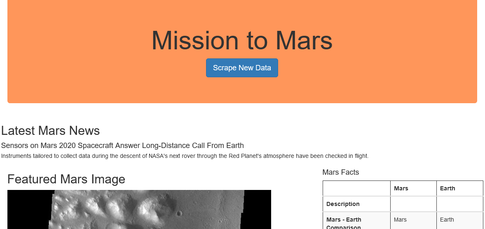

# Mission to Mars

## Overview

This project scrapes information from multiple sites to get news and images about Mars and space, and displays them on a simple web app. The initial design was done using Jupyter Lab to easily test out our code, and after we reached a working state we exported the code into a standalone Python file.

## Scraping

For the web scraping we used Splinter, BeautifulSoup4, and webdriver_manager. Webdriver_manager was used to decrease the amount of setup the end user has to do. To retrieve the data we used Splinter to easily navigate the webpages, and BeautifulSoup to help extract information from the HTML on each page. After scraping the data it is returned in a Python dictionary for easy storage. 

## Web App

Our web app uses MongoDB to hold our information, Bootstrap to style the app, and Flask to tie it all together. When the user clicks the 'Scrape New Data' button the app sends a request to the '/scrape' route which runs our scraping function. The app the redirects back to the homepage, which re-renders with the newly updated data. 
